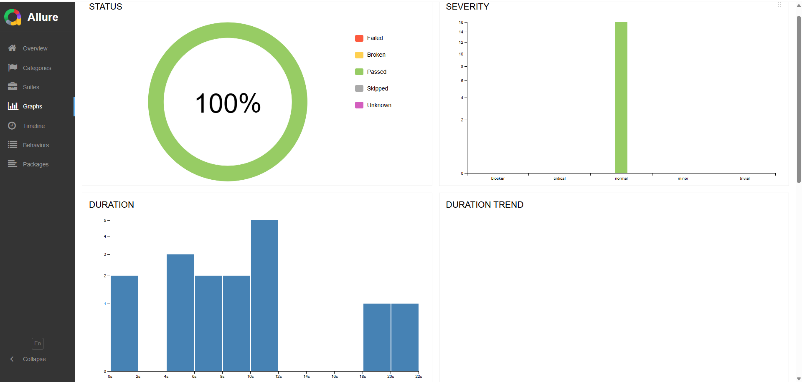
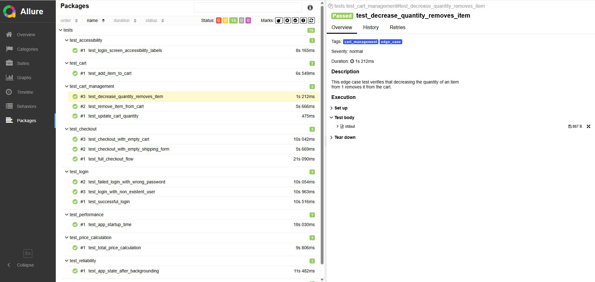

# Mobile App Test Automation Suite for "My Demo App"

## 1. Introduction

This repository contains a comprehensive mobile test automation suite for the Sauce Labs "My Demo App," a fully functional e-commerce application for Android. The project was built using **Python** with the **Appium** and **Pytest** frameworks, demonstrating a robust, scalable, and professional approach to mobile quality assurance.

The primary goal of this project is to showcase a wide range of testing methodologies, including:
* **Functional Testing** of core user journeys.
* **Negative Path & Edge Case Testing** to ensure application stability.
* **Non-Functional Testing** covering performance, accessibility, and reliability.
* Implementation of the **Page Object Model (POM)** for maintainable and scalable test code.
* Generation of professional, interactive test reports using **Allure**.

---

## 2. Features Tested

This test suite provides extensive coverage of the application's key features.

### Functional Scenarios (Happy Paths)
-   [x] **Successful User Login:** Verifies that a registered user can log in successfully.
-   [x] **Add Item to Cart:** Ensures a user can select a product, view its details, and add it to the shopping cart.
-   [x] **Product Sorting:**
    -   [x] Validates that products can be sorted by price, both ascending and descending.
-   [x] **Cart Management:**
    -   [x] Verifies that the quantity of an item in the cart can be increased.
    -   [x] Verifies that an item can be removed from the cart.
-   [x] **End-to-End Checkout:** Tests the full user journey from adding an item to the cart to completing the purchase, including filling out shipping and payment details.
-   [x] **Data Validation:**
    -   [x] Confirms that the total price in the cart is calculated correctly based on the items added.

### Negative Path & Edge Case Scenarios
-   [x] **Invalid Login:**
    -   [x] Verifies that an appropriate error message is displayed for a login attempt with a wrong password.
    -   [x] Verifies that an appropriate error message is displayed for a login attempt with a non-existent user.
-   [x] **Invalid Checkout:**
    -   [x] Ensures that form validation works correctly by attempting to submit an empty shipping address form.
    -   [x] Verifies that the app prevents checkout when the shopping cart is empty.
-   [x] **Cart Quantity Edge Case:**
    -   [x] Confirms that decreasing an item's quantity from 1 correctly removes it from the cart.

### Non-Functional Scenarios
-   [x] **Performance Testing:**
    -   [x] Measures the application's startup time to ensure it is within an acceptable performance threshold.
-   [x] **Accessibility Testing:**
    -   [x] Verifies that key interactive elements on the login screen have content-descriptions (accessibility labels) for screen reader compatibility.
-   [x] **Reliability Testing:**
    -   [x] Ensures the application maintains its state and user-entered data after being sent to the background and reopened.

---

## 3. Technologies Used

* **Automation Framework:** Appium 2.0
* **Programming Language:** Python 3.10+
* **Test Runner:** Pytest
* **Reporting:** Allure Framework
* **Appium Driver:** UiAutomator2
* **Application Under Test:** Sauce Labs "My Demo App" for Android

---

## 4. Project Structure

This project is built using the **Page Object Model (POM)**, a widely adopted design pattern in test automation for enhancing test maintenance and reducing code duplication.

* **/screens:** Contains individual Python classes for each screen of the mobile app (e.g., `login_screen.py`, `cart_screen.py`). Each class holds the locators and methods for interacting with the elements on that specific screen.
* **/tests:** Contains the actual test scripts, separated by feature (e.g., `test_login.py`, `test_checkout.py`). These tests use the methods from the screen objects to perform actions and make assertions.
* **/utils:** Contains utility scripts, such as the `driver_factory.py` which is responsible for creating and configuring the Appium driver session.
* **conftest.py:** A special Pytest file used for defining shared fixtures, such as the `setup_cart_with_item` fixture that prepares the app state before a test runs.
* **pytest.ini:** The configuration file for Pytest, used here to register custom markers.

---

## 5. Setup and Installation

To run this project locally, please follow these steps:

**Prerequisites:**
* Node.js and npm installed
* Java JDK (11 or higher) installed
* Android Studio installed with a configured Android Virtual Device (Emulator)
* Python 3.10+ installed

1.  **Install Appium:**
    ```bash
    npm install -g appium
    ```

2.  **Install the UiAutomator2 Driver:**
    ```bash
    appium driver install uiautomator2
    ```

3.  **Clone the Repository:**
    ```bash
    git clone [https://github.com/your-username/your-repository-name.git](https://github.com/your-username/your-repository-name.git)
    cd your-repository-name
    ```

4.  **Create a Virtual Environment and Install Dependencies:**
    ```bash
    # Create a virtual environment
    python -m venv .venv

    # Activate the virtual environment
    # On Windows:
    .\.venv\Scripts\activate
    # On macOS/Linux:
    # source .venv/bin/activate

    # Install all required Python packages
    pip install -r requirements.txt
    ```

5.  **Download the App:**
    Place the `Android-MyDemoAppRN.1.3.0.build-244.apk` file inside the `/apps` directory.

---

## 6. Running the Tests

**Before running tests, ensure that your Android Emulator is running and the Appium server is active in a separate terminal (`appium`).**

* **Run All Tests:**
    ```bash
    pytest
    ```

* **Run a Specific Test Suite (using markers):**
    ```bash
    # Run only checkout tests
    pytest -m checkout

    # Run only negative tests
    pytest -m negative
    ```

* **Generate Allure Report:**
    1.  Run the tests and generate the result files:
        ```bash
        pytest --alluredir=reports
        ```
    2.  Serve the HTML report in your browser:
        ```bash
        allure serve reports
        ```

---

## 7. Sample Allure Report

### Report Overview


### Test Packages View

